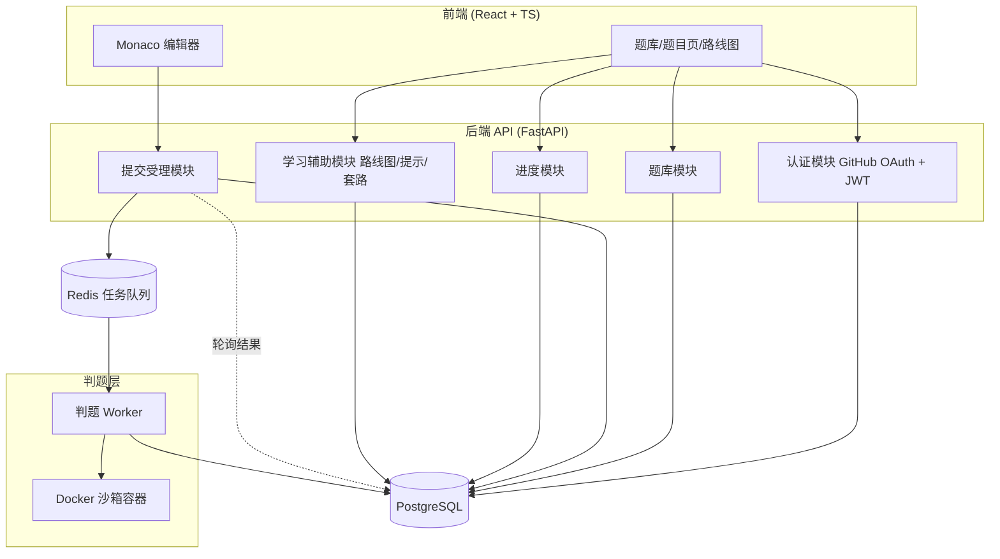
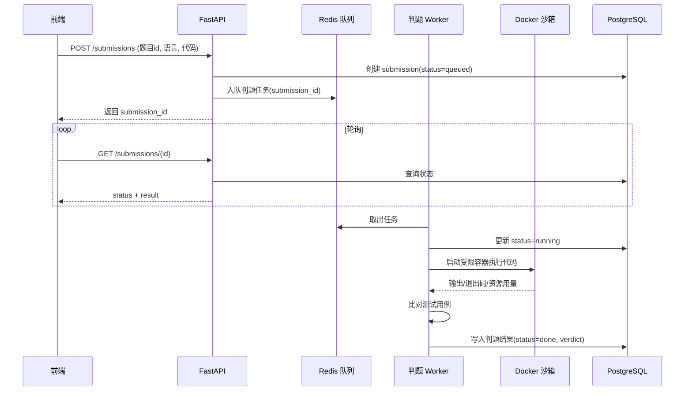
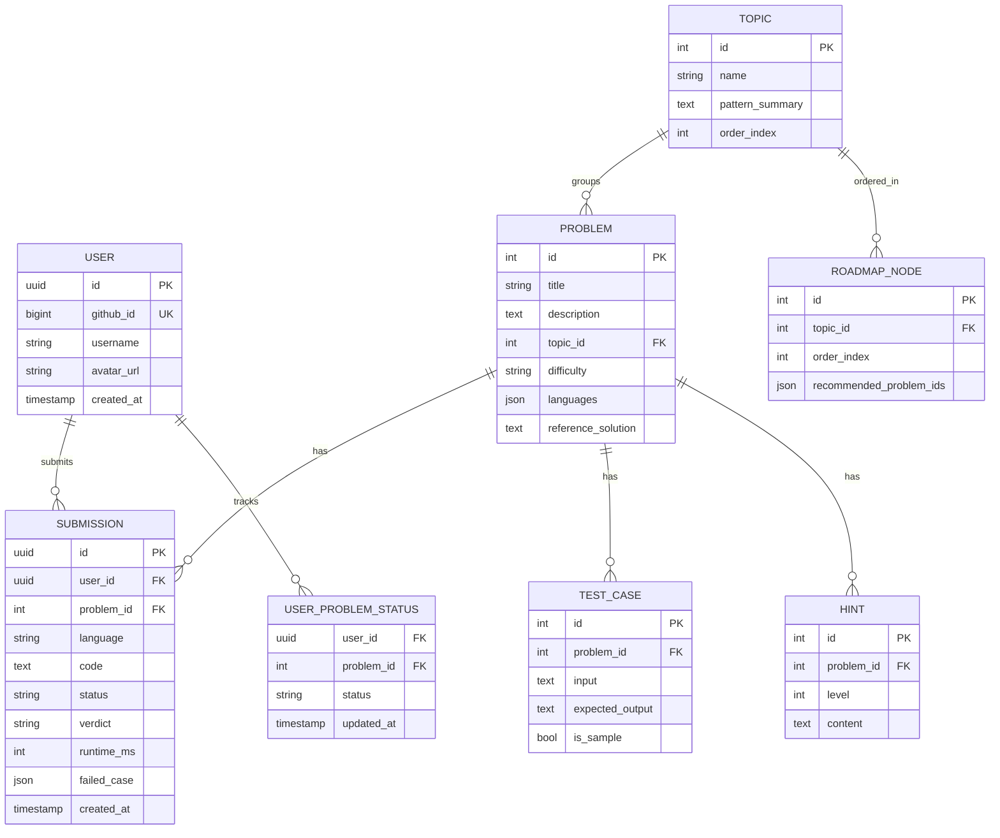

# 技术设计 — 算法道场 (AlgoDojo)

## 一、概述

本设计描述算法道场第一版（MVP）的技术实现方案，对应 requirements.md 的 8 个功能需求。系统核心是一个在线判题系统（Online Judge），关键技术难点在于**安全地执行用户提交的不可信代码**（判题沙箱）。

整体采用前后端分离 + 独立判题工作进程的架构：
- 前端：TypeScript + React Web 应用，内嵌 Monaco 编辑器。
- 后端 API：Python / FastAPI，负责认证、题库、提交受理、结果查询。
- 判题层：异步任务队列 + Worker，Worker 为每次提交拉起一个受限 Docker 容器执行代码。
- 存储：PostgreSQL（业务数据）+ Redis（任务队列与判题结果缓存）。

## 二、系统架构

### 提交判题数据流

## 三、核心模块设计：判题沙箱（重点）

这是系统安全与技术含量的核心。设计原则：**任何用户代码都不可信，必须在强隔离、资源受限、无网络的一次性容器中运行。**

### 3.1 执行流程

1. Worker 从 Redis 取出 `submission_id`，读取代码、语言、该题测试用例。
2. 将用户代码与"运行器（runner）脚本"写入临时工作目录。
3. 调用 Docker 启动一个一次性容器，挂载工作目录（只读代码 + 可写 /tmp），执行 runner。
4. runner 在容器内对每个测试用例运行用户代码，捕获 stdout/stderr/退出码。
5. Worker 收集结果，逐个用例比对期望输出，得出 verdict。
6. 容器执行结束（或超时被杀）后销毁，清理临时目录。

### 3.2 隔离与资源限制（对应需求 4.1-4.4）

| 维度 | 措施 |
| --- | --- |
| 进程隔离 | 每次提交独立容器，`--rm` 一次性销毁 |
| 网络 | `--network none` 完全禁网 |
| 用户权限 | 容器内非 root 用户运行，`--user 65534` |
| 文件系统 | `--read-only` 根只读，仅 `/tmp` 可写（`--tmpfs /tmp`） |
| CPU/时间 | `--cpus` 限制 + Worker 侧墙钟超时强杀（→ TLE） |
| 内存 | `--memory` 限制，`--memory-swap` 禁用 swap（→ MLE） |
| 进程数 | `--pids-limit` 防 fork 炸弹 |
| 能力 | `--cap-drop ALL`，禁用危险系统调用（seccomp profile） |

> 安全提示：本系统对外开放，执行不可信代码风险高。上述容器加固为最低要求；后续可引入 gVisor/Firecracker 进一步增强隔离。

### 3.3 多语言运行器（对应需求 3.2、4.7）

每种语言一个适配器，统一接口 `prepare(code) -> 可执行命令`：

- **Python**：直接 `python3 solution.py`；语法错误归类为运行时/编译错误。
- **TypeScript**：先 `tsc`/`esbuild` 编译为 JS（编译失败 → 编译错误），再 `node solution.js`。

沙箱镜像内预装 Python3 + Node + TypeScript 运行时（对应可部署性需求 2）。

### 3.4 判题判定（verdict）

| verdict | 含义 | 触发 |
| --- | --- | --- |
| AC | 通过 | 全部用例输出匹配 |
| WA | 答案错误 | 某用例输出不匹配，返回首个失败用例详情 |
| TLE | 超时 | 超过时间限制 |
| MLE | 内存超限 | 超过内存限制 |
| CE | 编译错误 | 编译阶段失败 |
| RE | 运行时错误 | 非零退出/异常 |

## 四、数据模型

> 套路速查（需求 8）可复用 TOPIC.pattern_summary，并增加一张 `PATTERN_TEMPLATE`（pattern_name, language, code, mnemonic）支撑按关键词检索。

## 五、后端 API 设计

| 方法 | 路径 | 说明 | 鉴权 |
| --- | --- | --- | --- |
| GET | /auth/github/login | 跳转 GitHub 授权 | 否 |
| GET | /auth/github/callback | OAuth 回调，签发 JWT | 否 |
| GET | /problems | 题库列表（含完成状态、筛选） | 是 |
| GET | /problems/{id} | 题目详情 + 模板 | 是 |
| POST | /submissions | 提交判题，入队 | 是 |
| GET | /submissions/{id} | 查询判题状态/结果 | 是 |
| GET | /problems/{id}/submissions | 某题历史提交 | 是 |
| GET | /problems/{id}/hints?level=n | 解锁第 n 层提示 | 是 |
| GET | /me/progress | 进度统计 | 是 |
| GET | /roadmap | 路线图 + 进度 | 是 |
| GET | /patterns | 套路速查（支持关键词检索） | 是 |

## 六、前端设计

- 技术栈：React + TypeScript + Monaco Editor + 状态管理（如 Zustand/React Query）。
- 关键页面：登录页、题库列表（按专题分组+筛选）、题目页（左题干/右编辑器+结果面板+分层提示抽屉）、路线图页、套路速查页、个人进度页。
- 提交后通过轮询 `GET /submissions/{id}` 展示"排队中/执行中/完成"状态（对应需求 4.8）。
- 代码草稿用 localStorage 暂存（对应需求 3.4）。

## 七、错误处理

| 场景 | 处理 |
| --- | --- |
| OAuth 失败/拒绝 | 返回错误码，前端停留登录页并提示（需求 1.6） |
| JWT 失效 | 401，前端跳登录 |
| 判题超时/超内存 | Worker 强杀容器，记 TLE/MLE，不阻塞队列 |
| 沙箱启动失败/Worker 异常 | submission 标记 system_error 并可重试，错误入日志（脱敏） |
| 队列积压 | 任务排队，前端显示排队位次（需求 4.10） |
| 敏感信息 | 日志不记录 JWT/OAuth token（非功能性安全 3） |

## 八、测试策略

- **单元测试**：verdict 比对逻辑、各语言运行器适配、OAuth 回调、进度状态机。
- **判题沙箱测试**：构造 TLE（死循环）、MLE（大数组）、CE（语法错误）、RE（抛异常）、AC/WA 各类用例，验证隔离与资源限制生效（含禁网、非 root 验证）。
- **集成测试**：提交→入队→判题→结果回写全链路。
- **API 测试**：鉴权与用户数据隔离（A 用户不能读 B 的提交）。

## 九、部署

- 容器化：API、Worker、PostgreSQL、Redis 各自容器，docker-compose 编排。
- 判题镜像：单独构建，内含 Python3 + Node + TypeScript 运行时。
- Worker 与判题容器需访问 Docker daemon（注意：挂载 docker.sock 有提权风险，生产建议用专用判题节点或 DinD/远程 Docker API 隔离）。
